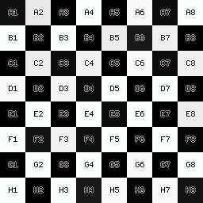
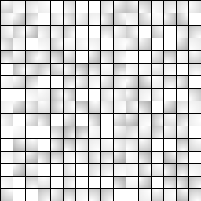
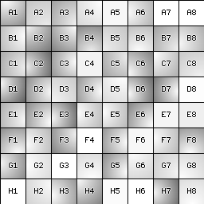
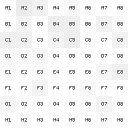
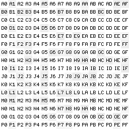
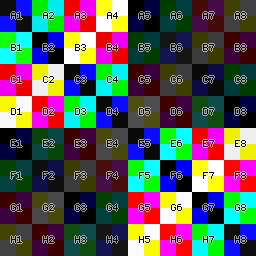

# Calibration/test image generator / Генератор калибровочных/тестовых изображений

I needed simple pictures to test the optics, such as a checkerboard, grids, circles and so on.
I could take such pictures on the Internets, but they are all different sizes and different quality, so it is very difficult to test anything with them.
Drawing such pictures in a graphics editor is also not an option - it's easy to make a mistake and the test pictures will no longer be ideal.

This repository contains test image generators that can:

* Draw Hilbert curve
* Draw a checkerboard
* Draw meshes
* Circles
* XOR pattern (in color)
* Color gradient
* Radial stripes (binary sun)
* Number grid (can be used to overlay other patterns)

The list is not large, and does not pretend to be complete of all possible tests; here is basically what I needed.

All of these generators have their own parameters, so you can create a huge number of desired images in a matter of seconds,
This is the advantage of parametric generation.

Some images are created by overlaying one or more overlays on top of each other, see the `build.sh` file. For example, colored
grid images are gradient overlays on grids.

For all these utilities to work, you will need packages such as `ImageMagick` (the `convert` utility), `ffmpeg` for converting pictures and `Perl` with
module `GD`.

The repository includes several test `PTO`/`PTS` files (for the `Hugin`/`PTGui` packages, respectively) with test patterns and a test panorama,
You can test software for stitching panoramas.

# Генератор калибровочных / тестовых изображений

Мне понадобились простые картинки для тестирования оптики, такие как шахматная доска, сетки, круги и тому подобные.
Я бы мог взять такие картинки в интернете, но все они разных размеров и различного качества, так что ими очень сложно что-либо тестировать.
Рисовать такие картинки в графическом редакторе тоже не вариант - легко допустить ошибку и тестовые картинки уже не будут идеальными.

В этом репозитории представлены генераторы тестовых картинок, которые могут:

* Рисовать кривую Гильберта
* Рисовать шахматную доску
* Рисовать сетки
* Круги
* Паттерн XOR (в цвете)
* Цветной градиент
* Радиальные полосы (бинарное солнце)
* Сетку с числами (можно использовать для наложения на другие паттерны)

Список не большой, да и не претендует на полноту всех возможных тестов, здесь в основном то, что понадобилось именно мне.

Все эти генераторы имеют свои собственные параметры, так что можно сделать огромное количество нужных изображений за считанные секунды,
в этом преимущество параметрической генерации.

Некоторые изображения получаются при помощи наложения одного или нескольких наложений друг на друга, смотри файл `build.sh`. Например, цветные
изображения сеток - это наложение градиента на сетки.

Для работы всех этих утилит нужны будут такие пакеты как `ImageMagick` (утилита `convert`), `ffmpeg` для конвертирования картинок и `Perl` с
модулем `GD`.

Репозиторий включает несколько тестовых `PTO`/`PTS` файлов (для пакетов `Hugin`/`PTGui` соответственно) с тестовыми паттернами и пробной панорамой,
можно тестировать софт для склейки панорам.

# Calibration patterns generator

# Gallery / Галерея

